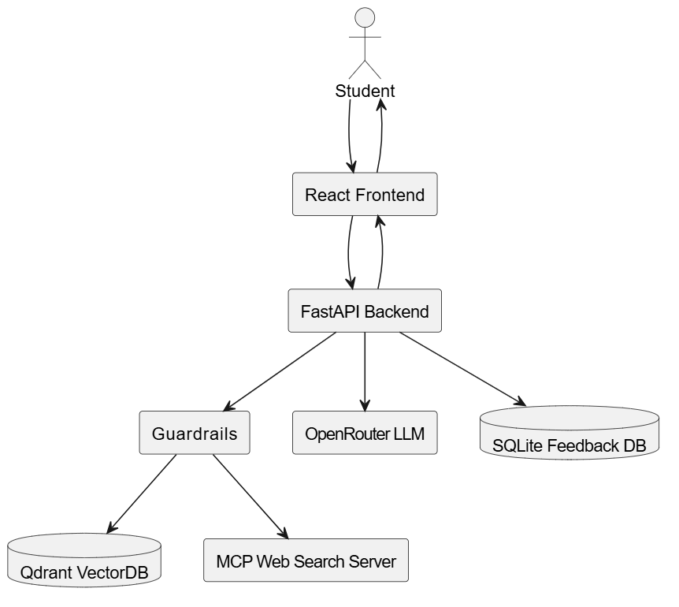
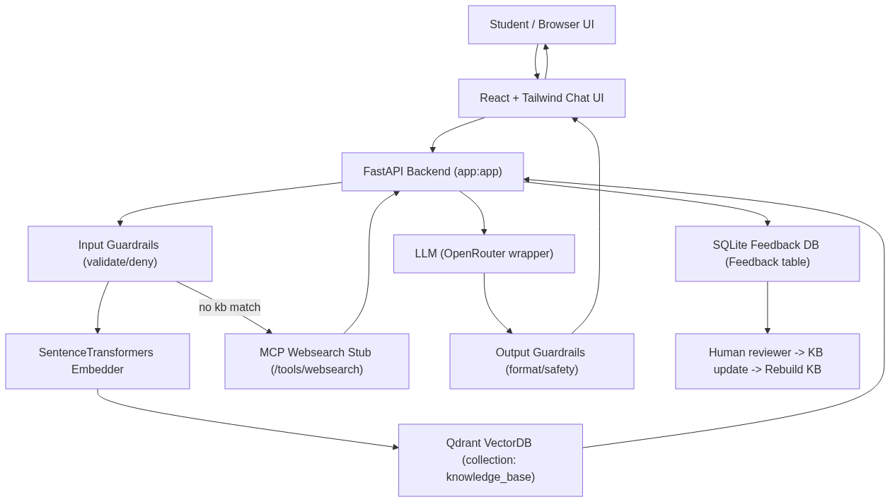
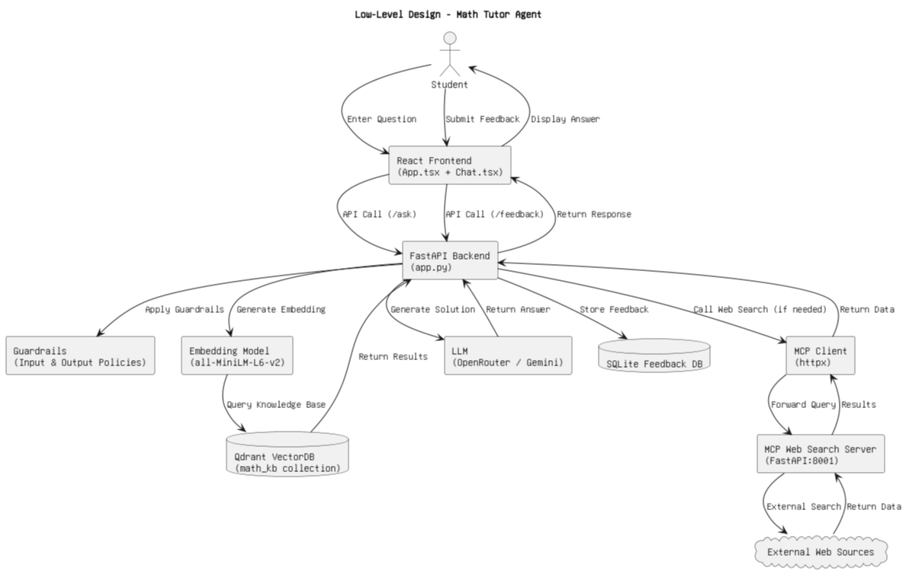

# AgentTuring - Math Routing Agent

[](https://opensource.org/licenses/MIT)
[](https://www.python.org/downloads/)
[](https://nodejs.org/)

An intelligent **Agentic RAG (Retrieval-Augmented Generation)** system that functions as a sophisticated math tutor. The system intelligently routes queries through a local knowledge base, web search capabilities, and large language models to provide comprehensive step-by-step mathematical explanations.

## 🚀 Key Features

- **Intelligent Routing Pipeline**: Knowledge Base → MCP Web Search → LLM generation
- **Vector-Based Retrieval**: Qdrant vector database with SentenceTransformers embeddings
- **Production-Ready Guardrails**: Input/output sanitization and PII detection
- **Human-in-the-Loop Feedback**: SQLite-backed feedback system for continuous improvement
- **Modern Frontend**: React + TypeScript + Vite with Tailwind CSS
- **Flexible LLM Support**: OpenRouter, Gemini, and local transformers integration

## 🏗️ System Architecture

### Overall Architecture


### High-Level Design


### Low-Level Design


## 📁 Project Structure

```
mcp-math-agent/
├── agentturing/                    # Core application package
│   ├── database/
│   │   ├── knowledge_base/         # Source KB documents (.txt files)
│   │   ├── setup_knowledgebase.py  # KB embedding & upsert script
│   │   └── vectorstore.py          # Qdrant client wrapper
│   ├── model/
│   │   └── llm.py                  # LLM abstraction layer
│   ├── mcp/
│   │   ├── client.py               # MCP client implementation
│   │   └── server_stub.py          # Local MCP web search server
│   ├── pipelines/
│   │   └── main_pipeline.py        # Main routing pipeline
│   └── utils/
│       ├── sanitize.py             # Output sanitization & PII detection
│       └── guardrails.py           # Input/output policy enforcement
├── frontend/                       # React frontend application
│   ├── package.json
│   ├── vite.config.ts
│   └── src/
│       ├── main.tsx
│       ├── App.tsx
│       └── components/
│           └── Chat.tsx
├── app.py                          # FastAPI backend entrypoint
├── requirements.txt                # Python dependencies
├── .env.example                    # Environment variables template
└── docs/                          # Architecture diagrams
    ├── overall_arch.png
    ├── hld.png
    └── lld.png
```

## ⚡ Quick Start

### Prerequisites

- **Python 3.10+** (virtual environment recommended)
- **Node.js 18+** and npm
- **Docker** (for Qdrant) or existing Qdrant instance

### 1. Environment Setup

```bash
# Clone the repository
git clone <repository-url>
cd mcp-math-agent

# Create and activate virtual environment
python -m venv .venv
source .venv/bin/activate  # Linux/macOS
# or
.venv\Scripts\activate     # Windows

# Install Python dependencies
pip install -r requirements.txt
```

### 2. Start Qdrant Vector Database

```bash
docker run -p 6333:6333 qdrant/qdrant:latest
```

### 3. Configure Environment Variables

Create `.env` file in project root:

```bash
# LLM Configuration
LLM_BACKEND=openrouter
OPENROUTER_API_KEY=your_openrouter_api_key_here

# Vector Database
QDRANT_URL=http://localhost:6333
QDRANT_API_KEY=

# Embedding Model (384-dimensional)
EMBEDDING_MODEL=sentence-transformers/all-MiniLM-L6-v2

# MCP Server Configuration
MCP_URL=http://localhost:8001
```

### 4. Initialize Knowledge Base

```bash
# Place your .txt math problems in agentturing/database/knowledge_base/
# Then build the vector embeddings
python agentturing/database/setup_knowledgebase.py --rebuild
```

### 5. Start Services

**Terminal 1: MCP Server**
```bash
python -m uvicorn agentturing.mcp.server_stub:app --reload --port 8001
```

**Terminal 2: Backend API**
```bash
python -m uvicorn app:app --reload --port 8000
```

**Terminal 3: Frontend**
```bash
cd frontend
npm install
npm run dev
```

### 6. Test the System

- Open browser to `http://localhost:5173` (frontend)
- API endpoint available at `http://localhost:8000`
- Test API directly: `POST http://localhost:8000/ask` with `{"question": "Solve x² + 2x + 1 = 0"}`

## 🔧 API Reference

### Ask Question
```http
POST /ask
Content-Type: application/json

{
    "question": "Find the derivative of x² + 3x + 2"
}
```

**Response:**
```json
{
    "answer": "Step-by-step solution...",
    "route": "kb|mcp|llm",
    "sources": ["source1", "source2"]
}
```

### Submit Feedback
```http
POST /feedback
Content-Type: application/json

{
    "question": "Find the derivative of x² + 3x + 2",
    "answer": "The derivative is 2x + 3",
    "rating": 5,
    "route": "kb"
}
```

## 🛠️ Configuration

### Embedding Models

The system uses SentenceTransformers for vector embeddings. Default model:
- `sentence-transformers/all-MiniLM-L6-v2` (384 dimensions)

**Important**: Embedding model must match Qdrant collection dimensions. If changing models, delete and rebuild the collection.

### LLM Backends

Supported LLM providers:
- **OpenRouter** (recommended for production)
- **Google Gemini**
- **Local Transformers** (for development)

## 🔍 Troubleshooting

### Vector Dimension Mismatch
```
Error: expected dim: 384, got 1024
```
**Solution**: Delete Qdrant collection and rebuild with correct embedding model:
```bash
curl -X DELETE "http://localhost:6333/collections/knowledge_base"
python agentturing/database/setup_knowledgebase.py --rebuild
```

### HuggingFace Model Issues
```
HFValidationError: Repo id must use alphanumeric chars
```
**Solution**: Ensure `LLM_BACKEND=openrouter` in `.env` if using OpenRouter API, not local transformers.

### Qdrant Client Version Warning
Update qdrant-client package to match server version:
```bash
pip install --upgrade qdrant-client
```

## 📊 Human-in-the-Loop Feedback

The system includes a comprehensive feedback mechanism:

1. **UI Integration**: Good/Bad rating buttons after each answer
2. **Data Storage**: Feedback persisted to SQLite database
3. **Continuous Improvement**: Data used for KB refinement and model fine-tuning

## 🏭 Production Deployment

### Recommended Setup
- Use managed LLM services (OpenRouter/Gemini) instead of local models
- Deploy Qdrant on dedicated infrastructure
- Implement proper authentication and rate limiting
- Set up monitoring and logging
- Use environment-specific configuration files

### Performance Considerations
- Vector search performance scales with collection size
- Consider embedding caching for frequent queries
- Implement connection pooling for database connections

## 🧪 Development

### Adding New Math Problems
1. Create `.txt` files in `agentturing/database/knowledge_base/`
2. Run `python agentturing/database/setup_knowledgebase.py --rebuild`

### Frontend Development
The frontend uses modern React with TypeScript:
- **Build Tool**: Vite for fast development and building
- **Styling**: Tailwind CSS for utility-first styling
- **State Management**: React hooks for local state

### Testing
```bash
# Backend tests
python -m pytest

# Frontend tests
cd frontend
npm test
```

## 📚 Architecture Details

### Routing Pipeline
1. **Knowledge Base Search**: Vector similarity search in Qdrant
2. **Web Search Fallback**: MCP server performs external web search
3. **LLM Generation**: Context-aware answer generation
4. **Guardrails**: Input sanitization and output validation

### Data Flow
1. User submits question through React frontend
2. FastAPI backend processes and sanitizes input
3. Pipeline routes through KB → Web Search → LLM as needed
4. Guardrails validate output before returning to user
5. Feedback collected and stored for system improvement

## 📄 License

This project is licensed under the MIT License - see the [LICENSE](LICENSE) file for details.

## 🤝 Contributing

We welcome contributions! Please see our [Contributing Guidelines](CONTRIBUTING.md) for details.

1. Fork the repository
2. Create a feature branch (`git checkout -b feature/amazing-feature`)
3. Commit your changes (`git commit -m 'Add amazing feature'`)
4. Push to the branch (`git push origin feature/amazing-feature`)
5. Open a Pull Request

## 🚦 Roadmap

- [ ] Benchmark integration (JEE dataset)
- [ ] Advanced feedback loop with DSPy
- [ ] Multi-modal support (LaTeX, graphs)
- [ ] Distributed vector search
- [ ] Enhanced security features
- [ ] Performance monitoring dashboard

---

**Built with ❤️ for mathematical education and AI-powered learning**